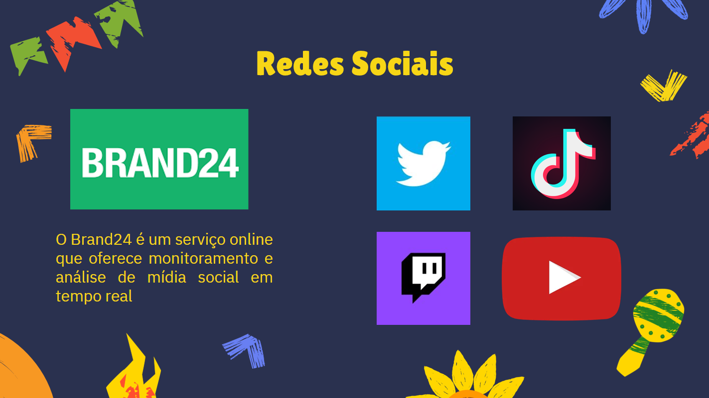
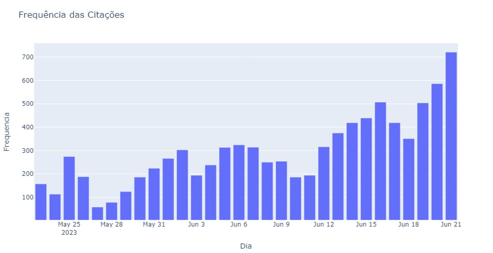
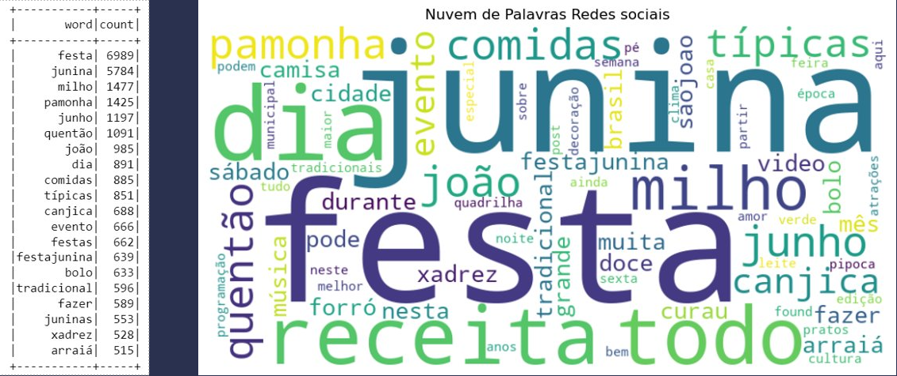
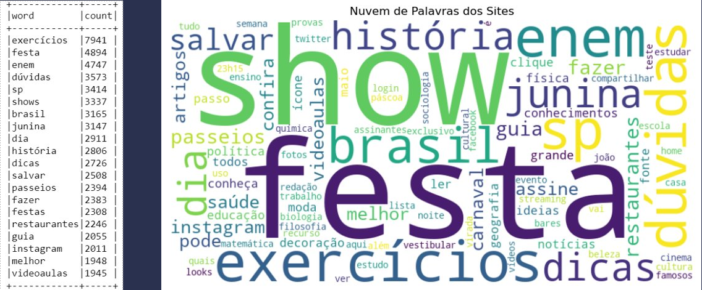

# Costume-Trends-Scraper

# 1. Objetivo de Negócio:
Nós somos uma empresa de aluguel de roupas e fantasias que está se preparando para o próximo grande evento , as festas juninas. Como parte da equipe de marketing, estamos conduzindo um estudo abrangente sobre esse tema. Para isso, estamos empregando técnicas de web scraping para identificar as palavras-chave mais relevantes associadas ao nosso negócio.

Com base nessa análise, nossa intenção é selecionar cuidadosamente 20 sites nos quais podemos anunciar nossos produtos. Para determinar sua adequação, consideraremos o conteúdo desses websites. Se o conteúdo estiver relacionado às palavras-chave relevantes para nossos produtos, consideraremos esses sites como parceiros ideais para nossos anúncios.

Essa abordagem nos permitirá direcionar nossa publicidade de forma estratégica, alcançando um público engajado e interessado em nossos produtos de aluguel de roupas e fantasias para as festas juninas.

# 2. Estrutura do Projeto

(1) Na primeira etapa do projeto, identificamos comunidades relacionadas aos nossos produtos usando as redes sociais. Utilizamos a plataforma Brand24 para coletar e centralizar publicações de várias redes sociais, com base em hashtags e palavras-chave relevantes para o nosso negócio. Isso nos permitiu ter uma visão abrangente das discussões e interações relacionadas aos nossos produtos em plataformas populares como TikTok, Twitter, YouTube, entre outros.

(2) Definimos uma lista de palavras relacionadas às festas juninas com base em sua frequência de aparição nas redes sociais. Essa lista serviu para validar os sites selecionados posteriormente.

(3) Nessa etapa, os membros do grupo selecionam cuidadosamente os sites potencialmente relacionados ao nosso produto. Em seguida, eles passam por um processo de validação, comparando os sites com as palavras coletadas das redes sociais e avaliando a semelhança entre elas. Isso nos permite determinar se um site é adequado ou não para a nossa estratégia de marketing.

(4) Após a validação, restam apenas alguns dos sites mais relevantes para fazer os anúncios.

(5) Utilizamos a análise de sentimento para identificar palavras mencionadas em contextos negativos. O Brand24 oferece ferramentas que auxiliam nessa análise.

(6) A análise de bigramas nos permite visualizar combinações frequentes de palavras, revelando insights sobre a estrutura do texto e o contexto das palavras.

# 3. Scraping das Redes Sociais

Para realizar o scraping, utilizamos o site Brand24, No entanto, é importante mencionar que o site nos permite utilizar apenas 10 palavras-chave para iniciar a busca:

* #festajunina
* festa junina
* camisa xadrez
* pamonha
* curau de milho
* quentão
* dança de quadrilha
* #saojoao
* sao joao

O site centraliza publicações de várias redes sociais e sites com base em hashtags e palavras-chave. Essa plataforma nos possibilitou coletar postagens do TikTok, Twitter, YouTube e outros sites relevantes.

https://brand24.com/?adgr=txt-brand-iv-test&keyword-ext=brand24&placement&location=1001773&gclid=CjwKCAjwscGjBhAXEiwAswQqNBPItdcSr7XQ-DUsb5mc4mPX5cLbRrXg0XrBNKEjvaHYvf9VXVKcaxoCfz0QAvD_BwE

Essas palavras-chave nos ajudarão a identificar o conteúdo mais relevante relacionado com nosso produto, e com isso usaremos as palavras coletadas das redes sociais para validar quais sites são apropriados para nossos anúncios

## 3.1 Análise de citações no Mês de junho e fim de maio

A análise de frequência por dia nos permite visualizar quando as citações começam a aumentar e, portanto, em que época do ano devemos começar a investir em marketing do nosso produto. Isso é especialmente importante, uma vez que nosso produto é sazonal, e investir nas horas erradas pode causar prejuízos.

Através de análises feitas nosso grupo concluiu que dia 20/5 é um bom dia para começar investimentos, visto que é quando as citações começam a aumentar de forma mais consideravel. Não esta ilustrado, mas nosso grupo também coletou uma amostra de dados entre dia 17/5 até dia 26/5 o que ajudou nessa conclusão

## 3.2 Resultado WordCloud das redes

As palavras que foram escolhidas para validar estão nessa tabela a esquerda, nós escolhemos a dedo qual delas nos iriamos utilizar.
A Contagem de palavras é feita utilizando Pyspark

# 4. Web Scraping 
Cada integrante do grupo escolheu de 5-7 sites a dedo que achamos que tinha relação com o tema da festa junina, o objetivo é usar as palavras frequentemente usada na nossa comunidade (redes socias) para selecionar apenas alguns sites mais adequados para a realização dos nossos anúncios.

## 4.1 Análise de bigramas

A análise de bigramas básicamente serve para visualizar quais palavras aparecem frequentemente juntas, sendo assim revelando combinações comuns de palavras (ou palavras compostas) e fornece insights sobre a estrutura do texto e o contexto das palavras

Essa analise será feitas com todos os sites que nossa equipe selecionou que podem ter a ver com o nosso tema, e com isso, o csv utilizado é 'dados_sites.csv'.

referentes a público-alvo:
* (brasil,escola) com frequencia de 765
* (ensino,médio) com frequencia de 317
* (diversão, educando) com frequencia de 256

referentes a época:
* (fim, semana) com frequencia de 2004
* (final,semana) com frequencia de 349

referentes a local:
* (parque, ibirapuera) com frequencia de 266

Os bigramas de público-alvo ajudou o nosso grupo a perceber a necessidade de buscar mais sites relacionados ao público infantil, então depois disso escolhemos mais alguns sites para participarem do processo de validação, como por exemplo o site da loja ABRAKADABRA.

## 4.2 Resultado WordCloud dos sites

O WordCloud de todos os sites que nos reunimos ficou assim:

A existência de vários termos diferentes em relação aos das redes sociais representa a necessidade de filtrar muitos dos sites que podem não ter muito a ver com o nosso público-alvo.
A Contagem de palavras é feita utilizando Pyspark

# 5. Conclusão

Dentro as dezenas de sites que analisamos ao decorrer desse projeto, aqui estão os sites que escolhemos para anunciar nossos produtos junto as palavras que aparecerem em cada um deles.

| Sites |  festa | junina | comidas | joão | milho | junho | canjica | quentão | Soma das palavras relevantes |
| -- | -- | -- | -- | -- | -- | -- | -- | -- | -- |
| www.sympla.com.br | 83 | 17 | 8 | 22 | 0 | 14 | 0 | 4 | **148** |
| www.fazfacil.com.br | 16 | 10 | 1 | 2 | 1 | 2 | 0 | 1 | **33** |
| www.abrakadabra.com.br | 49 | 42 | 0 | 0 | 0 | 0 | 0 | 0 | **91** |
| www.guia.folha.uol.com.br | 94 | 68	 | 17 | 80 | 0 | 0 | 0 | 0 | **259** |
| www.catracalivre.com.br | 13 | 9 | 0 | 0 | 0 | 4 | 0 | 0 | **26** |
| www.brasilescola.uol.com.br | 54 | 49 | 6 | 4 | 1 | 0 | 0 | 0 | **114** |
| www.blog.xalingo.com.br | 83 | 41 | 8 | 28 | 6 | 25 | 0 | 2 | **193** |
| www.all.accor.com | 29 | 11 | 7 | 3 | 4 | 1 | 1 | 2 | **58** |
|**TOTAL** | **421** | **247** | **47** | **139** | **12** | **46** | **1** | **9** | ***922*** |

Dentre essas opções, recomendaria fortemente que minha equipe investisse no site 'www.sympla.com.br', pois ocupa a terceira posição entre os sites com maior relevância de palavras. Seu conteúdo está focado na venda de ingressos para eventos, e de acordo com nossas pesquisas, a maioria dos eventos atualmente são de festas juninas.

